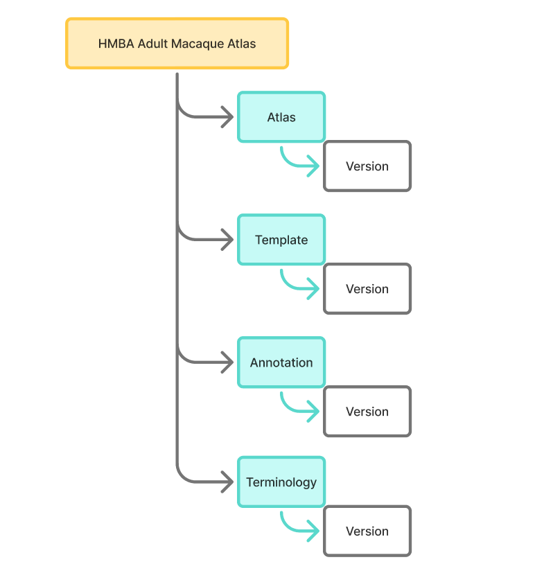

### Atlas organization

Each atlas is organized according to the [Allen Atlas assets data schema](https://atlas-assets.readthedocs.io/en/latest/index.html#file-organization) and contains a `manifest.json` file that shows the names and relative paths of all of the data assets that are required for usage. Data assets can be accessed from the public S3 bucket and used for local/offline use.

The example for macaque is shown below.

