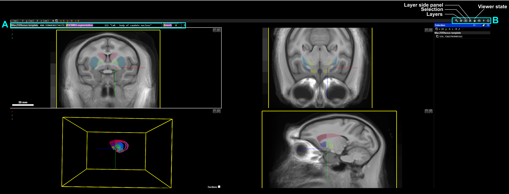

# Neuroglancer Tutorial: An Introduction for Scientists

[Neuroglancer](https://github.com/google/neuroglancer) is a powerful, open‑source, web‑based visualization tool for exploring large volumetric datasets, including dense electron microscopy data in [connectomics](https://www.microns-explorer.org/) and [cell biology](https://cryoetdataportal.czscience.com/). It enables interactive viewing of 3D image volumes, annotations, and 3D meshes using only a web browser and an internet connection. This permits visualization of large datasets that are stored on a cloud server, such as Amazon Web Services (AWS) or Google Cloud Platform (GCP). Neuroglancer also has programmatic access via a [python API](https://neuroglancer-docs.web.app/python/api/index.html#) for customization. 

This tutorial is designed to help orient a new user to the neuroglancer interface and show the basic functions of navigating the visualizer and saving the viewer state. For this tutorial, we will use the [HMBA macaque CCF](descriptions/macaque_ccf.md) as an example. 

## 1. Interface Overview

#### Panel layout
Neuroglancer’s default layout includes:
- Three **2D image panels** showing the orthogonal axes (anterior-posterior, dorsal-ventral, medial-lateral)
- A **3D view panel** showing the annotations 
    - *Note*: 2D sections can be shown in the 3D view panel by clicking the `Sections` [] box. 

#### Layer Organization (A)  
Atlas data is organized into three components:
- **template** — represents underlying MRI template as a grayscale image
- **HOMBA_segmentation** — Anatomical annotation that parcellates the brain into defined segments, which can be visualized by hovering the mouse over the parcellation. In the above example, this has highlighted the `body of the caudate nucleus`
- **mesh** — A 3D volumetric mesh representation of the anatomical annotations.

Layers may also include **annotations**, which represent points (eg. cell bodies, landmark pins, etc.). This layer is not present in the example above. 
