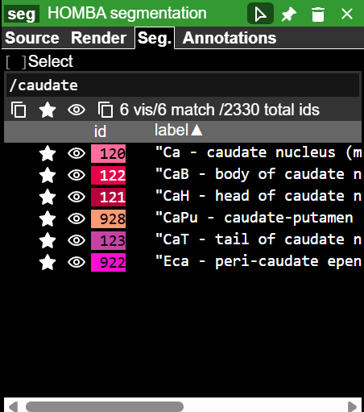

## Navigating neuroglancer

[Neuroglancer](https://github.com/google/neuroglancer) is a powerful, open‑source, web‑based visualization tool for exploring large volumetric datasets, including dense electron microscopy data in [connectomics](https://www.microns-explorer.org/) and [cell biology](https://cryoetdataportal.czscience.com/). It enables interactive viewing of 3D image volumes, annotations, and 3D meshes using only a web browser and an internet connection. This permits visualization of large datasets that are stored on a cloud server, such as Amazon Web Services (AWS) or Google Cloud Platform (GCP). Neuroglancer also has programmatic access via a [python API](https://neuroglancer-docs.web.app/python/api/index.html#) for customization. 

This tutorial is designed to help orient a new user to the neuroglancer interface and show the basic functions of navigating the visualizer and saving the viewer state. For this tutorial, we will use the [HMBA macaque CCF](descriptions/macaque_ccf.md) as an example. 

### 1. Interface Overview

#### Panel layout
Neuroglancer’s default layout includes:
- Three **2D image panels** showing the orthogonal axes (anterior-posterior, dorsal-ventral, medial-lateral)
- A **3D view panel** showing the annotations 
    - *Note*: 2D sections can be shown in the 3D view panel by clicking the `Sections` [] box or by pressing the **S** key. 

#### Layer Organization (A)  
Atlas data is organized into three components represented as layers in the `layers` tab.
- **template** — represents underlying MRI template as a grayscale image
- **HOMBA_segmentation** — Anatomical annotation that parcellates the brain into defined segments, which can be visualized by hovering the mouse over the parcellation. In the above example, this has highlighted the `body of the caudate nucleus`
- **mesh** — A 3D volumetric mesh representation of the anatomical annotations.

Layers may also include **annotations**, which represent points (eg. cell bodies, landmark pins, etc.). This layer is not present in the example but can be seen in the [HMBA basal ganglia data release](https://neuroglancer-demo.appspot.com/#!https://allen-hmba-releases.s3.us-west-2.amazonaws.com/neuroglancer/macaque/HMBA-10X-Multiome-BG-MacaqueSlabROI/20250630/viewer_state/macaque_roi_pins_ccf.json). 

#### Panel organization (B)

Panel buttons (top right) are used for toggling layers, selecting specific anatomical parcellations, controlling visualization parameters (eg. opacity, contrast), etc. 

- **Layers** - Show/Hide layers list panel. Layers panel usage is described [below](#3-working-with-layers)
- **Selection** - Show/Hide selection window, which shows linked data and metadata to cursor position. In the example image, the Selection panel shows current {x,y,z} coordinate in mm.
    - *Note*: selection can be pinned in place with Ctrl+Right click. This is helpful if selection details need to be copied for use in downstream analyses
- **Layer side panel** - Show/hide layer panel, which shows information about data source, affine transforms, annotation labels, etc. Example usage is described [below](#4-using-the-layer-side-panel-for-selecting-atlas-subdivisions)
- **Viewer state** - Show the [JSON viewer state](#5-reproducibility-and-sharing-using-the-json-viewer-state) 

### 2. Basic Navigation & Controls

| Action                          | User input                                     |
|---------------------------------|------------------------------------------------|
| Pan (2D)                        | Click and drag in the 2D panel                 |
| Rotate (3D)                     | Left-click and drag in the 3D panel            |
| Move through slices             | Scroll wheel (2D) or scroll projection (3D)    |
| Zoom                            | Ctrl + scroll or pinch on touch devices        |
| Right-click centering           | Right-click targets to center the view         |
| Switch panel layout             | Press **Space**, or use layout icon in panels  |
| Snap to nearest axes            | Press **Z**                                    |
| Toggle oriented slice overlay   | Press **S** (3D view)                          |
| Show/hide colored axis lines    | Press **A**                                    |

### 3. Working with Layers

- **Toggle visibility**: Click the [layers button](#panel-organization-b) in the panel buttons to toggle on/off. Current invisible layers are shown with strikethrough text in the [layer organization](#layer-organization-a) tab or with a strikethrough of the &#x1f441; symbol in the layers window. Layers can be turned on by clicking the &#x1f441; symbol.
- **Rendering controls** (e.g., adjust contrast, opacity, blending, volume rendering for 3D data) are accessible by clicking on the [layer side panel](#panel-organization-b) in the panel buttons, in the layers window, or using Ctrl‑click on the layer.

### 4. Using the layer side panel for selecting atlas subdivisions

Neuroglancer allows for selecting and displaying individual anatomical annotations. By default, all annotated structures are shown in the segmentation and mesh layers.

Individual anatomical annotations can be toggled on/off by double clicking on the annotation in any of the views. Note that the segmentation and mesh layers are linked. 

Neuroglancer also permits selecting anatomical annotations using a text search in the **layer side panel**. 

For example, to select all structures that contain the word `caudate`:

- Select the `Seg.` tab
- In the text box, type `/` followed by your search term with partial matches included
    - *Note*: in Neuroglancer, the `/` symbol allows for searching by regular expressions, eg. `/\d` shows all structures that contain a digit in the name or acronym 
- Toggle on/off by clicking the &#x1f441; icon. Clicking the icon at the top toggles all search hits on/off

### 5. Reproducibility and sharing using the JSON viewer state

One of the most powerful features in Neuroglancer is the ability to save the current view as a JSON object that can be shared. The current JSON state, which includes the view angle, panels, and visible layers, can be accessed by clicking the **viewer state** button in the panel buttons window. 

- To save the current view, click the `Download` button, which saves the JSON viewer state. 
- To load a previously saved JSON state, delete the current JSON and replace it with a previously saved JSON file (this can be done by click-and-drag the file from your local directory into the viewer state window)

